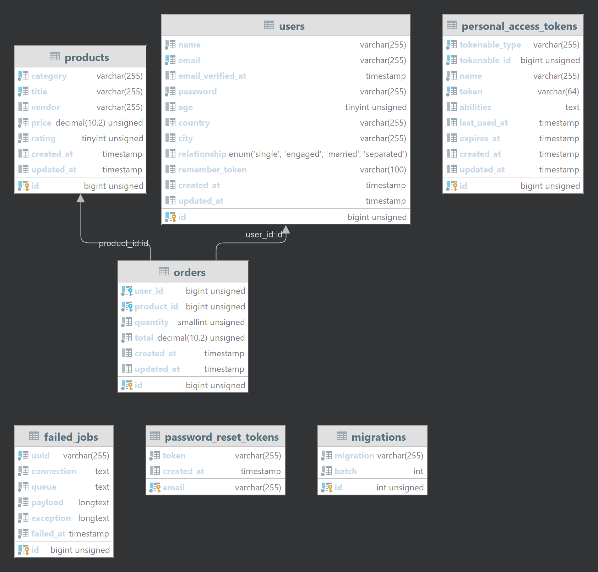

# Nanny Nina Assessment
According to assessment's description, the system is designed in such a way that it can filter any field with any condition.

## Filtering
URL parameters is the most flexible and simple way to add basic/complicated filtering to REST APIs.\
Using query string array for conditions benefits:
- Flexibility to implement any type of conditions.
- Ease of use for clients.
- Simple to parse on server side.

## Examples:
- `GET` `/api/users` Retrieve all users' data
- `GET` `/api/users?filters[]=name like ja%` Retrieve users names starts with 'ja'
- `GET` `/api/users?filters[]=name like ja%&filters[]=age <= 25` Retrieve users names starts with 'ja' and age less than or equal to 25
- `GET` `/api/users?filters[]=age > 10&filters[]=age <= 25` Retrieve users with age greater than 10 and age less than or equal to 25
- `GET` `/api/users?filters[]=name like %a%&filters[]=age>25&filters[]=relationship=Engaged` Retrieve users names contains 'a' and age greater than 25 that has Engaged relationship

## Condition Operators
| Operator | Description                           |
|----------|---------------------------------------|
| LIKE     | Filter for a specified string pattern |
| =        | Equal to                              |
| >        | Greater than                          |
| <        | Less than                             |
| >=       | Greater than or equal to              |
| <=       | Less than or equal to                 |
| <>       | Not equal to                          |
| !=       | Not equal to                          |

## Database Diagram

## Tasks
- [x] Update User Model (migration, factory, seeder, unit test)
- [x] Create Extra Models (migration, factory, seeder, unit test)
- [x] Create Relation (unit test, diagram)
- [x] Migrate and Seed the Database
- [x] Implement Filterable Mechanism
- [x] Add Controller and Route
- [x] Manual Testing (outputs)
- [x] Write Documentation (readme)